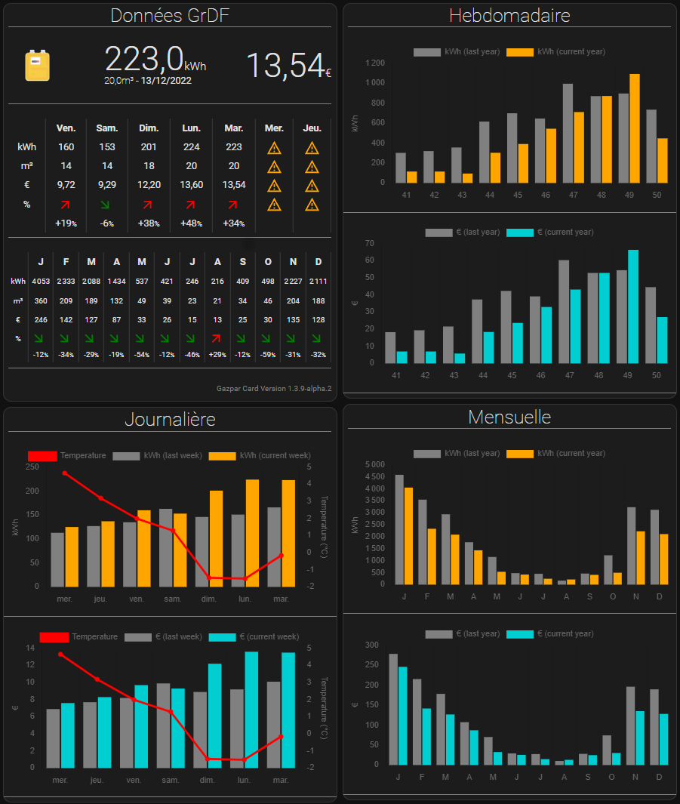
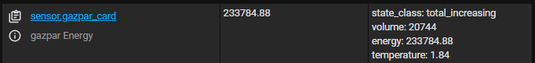
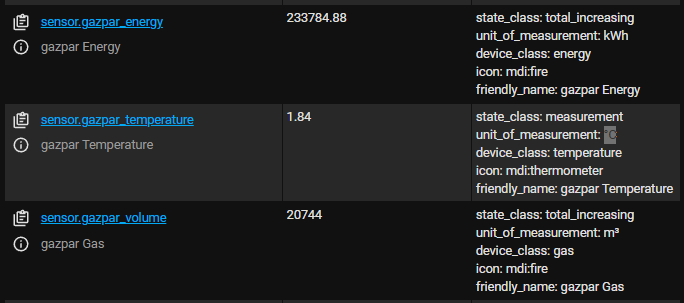

# Gazpar2MQTT

Gazpar2MQTT is a gateway that reads data from the GrDF (French gas provider) meter and posts it to a MQTT message broker.

It is compatible with [Lovelace Garpar Card](https://github.com/ssenart/lovelace-gazpar-card) with version >= 1.3.11-alpha.3.



Gazpar2MQTT is using [PyGazpar](https://github.com/ssenart/PyGazpar) library to retrieve GrDF data.

## Installation

Gazpar2MQTT can be installed in many ways.

### 1. Home Assistant Add-on

In the **Add-on store**, click **⋮ → Repositories**, fill in **`https://github.com/ssenart/gazpar2mqtt`** and click **Add → Close** or click the **Add repository** button below, click **Add → Close** (You might need to enter the **internal IP address** of your Home Assistant instance first).

[](https://my.home-assistant.io/redirect/supervisor_add_addon_repository/?repository_url=https%3A%2F%2Fgithub.com%2Fssenart%2Fgazpar2mqtt)

For usage and configuration, read the documentation [here](addons/gazpar2mqtt/DOCS.md).

### 2. Using Docker Hub

The following steps permits to run a container from an existing image available in the Docker Hub repository.

1. Copy and save the following docker-compose.yaml file:

```yaml
services:
  gazpar2mqtt:
    image: ssenart/gazpar2mqtt:latest
    container_name: gazpar2mqtt
    restart: unless-stopped
    network_mode: bridge
    user: "1000:1000"
    volumes:
      - ./gazpar2mqtt/config:/app/config
      - ./gazpar2mqtt/log:/app/log
    environment:
      - GRDF_USERNAME=<GrDF account username>
      - GRDF_PASSWORD=<GrDF account password>
      - GRDF_PCE_IDENTIFIER=<GrDF PCE meter identifier>
      - MQTT_BROKER=<MQTT broker ip adcress>
```

Edit the environment variable section according to your setup.

2. Run the container:

```sh
$ docker compose up -d
```

### 3. Using PIP package

```sh
$ cd /path/to/my_install_folder/

$ mkdir gazpar2mqtt

$ cd gazpar2mqtt

$ python -m venv .venv

$ source .venv/bin/activate

$ pip install gazpar2mqtt

```

### 4. Using Dockerfile

The following steps permit to build the Docker image based on the local source files.

1. Clone the repo locally:

```sh
$ cd /path/to/my_install_folder/

$ git clone https://github.com/ssenart/gazpar2mqtt.git
```

2. Edit the docker-compose.yaml file by setting the environment variables corresponding to your GrDF account and MQTT setup:

```yaml
environment:
  - GRDF_USERNAME=<GrDF account username>
  - GRDF_PASSWORD=<GrDF account password>
  - GRDF_PCE_IDENTIFIER=<GrDF PCE meter identifier>
  - MQTT_BROKER=<MQTT broker ip adcress>
```

3. Build the image:

```sh
$ docker compose build
```

4. Run the container:

```sh
$ docker compose up -d
```

### 5. Using source files

The project requires [Poetry](https://python-poetry.org/) tool for dependency and package management.

```sh
$ cd /path/to/my_install_folder/

$ git clone https://github.com/ssenart/gazpar2mqtt.git

$ cd gazpar2mqtt

$ poetry install

$ poetry shell

```

## Usage

### Command line

```sh
$ python -m gazpar2mqtt --config /path/to/configuration.yaml --secrets /path/to/secrets.yaml
```

### Configuration file

The default configuration file is below.

```yaml
logging:
  file: log/gazpar2mqtt.log
  console: true
  level: debug
  format: "%(asctime)s %(levelname)s [%(name)s] %(message)s"

grdf:
  scan_interval: ${GRDF_SCAN_INTERVAL} # Number of minutes between each data retrieval (0 means no scan: a single data retrieval at startup, then stops).
  devices:
    - name: gazpar
      username: "!secret grdf.username"
      password: "!secret grdf.password"
      pce_identifier: "!secret grdf.pce_identifier"
      last_days: ${GRDF_LAST_DAYS} # Number of days of data to retrieve

mqtt:
  broker: "!secret mqtt.broker"
  port: "!secret mqtt.port"
  username: "!secret mqtt.username"
  password: "!secret mqtt.password"
  keepalive: 60
  base_topic: gazpar2mqtt

homeassistant:
  discovery: true
  discovery_topic: homeassistant
  entities:
    card:
      device_class: energy
      enabled_by_default: true
      icon: mdi:fire
      state_class: total_increasing
      state_topic: "{{ mqtt_base_topic }}/{{ device_name }}"
      unit_of_measurement: kWh
      json_attributes_topic: "{{ mqtt_base_topic }}/{{ device_name }}"
      value_template: "{{ value_json.energy }}"

    energy:
      device_class: energy
      enabled_by_default: true
      icon: mdi:fire
      state_class: total_increasing
      state_topic: "{{ mqtt_base_topic }}/{{ device_name }}"
      unit_of_measurement: kWh
      value_template: "{{ value_json.energy }}"

    volume:
      device_class: gas
      enabled_by_default: true
      icon: mdi:fire
      state_class: total_increasing
      state_topic: "{{ mqtt_base_topic }}/{{ device_name }}"
      unit_of_measurement: "m³"
      value_template: "{{ value_json.volume }}"

    temperature:
      device_class: temperature
      enabled_by_default: true
      icon: mdi:thermometer
      state_class: measurement
      state_topic: "{{ mqtt_base_topic }}/{{ device_name }}"
      unit_of_measurement: "°C"
      value_template: "{{ value_json.temperature }}"
```

The default secret file:

```yaml
grdf.username: ${GRDF_USERNAME}
grdf.password: ${GRDF_PASSWORD}
grdf.pce_identifier: ${GRDF_PCE_IDENTIFIER}

mqtt.broker: ${MQTT_BROKER}
mqtt.port: ${MQTT_PORT}
mqtt.username: ${MQTT_USERNAME}
mqtt.password: ${MQTT_PASSWORD}
```

### Environment variable for Docker

In a Docker environment, the configurations files are instantiated by replacing the environment variables below in the template files:

| Environment variable | Description                                                                   | Required | Default value  |
| -------------------- | ----------------------------------------------------------------------------- | -------- | -------------- |
| GRDF_USERNAME        | GrDF account user name                                                        | Yes      | -              |
| GRDF_PASSWORD        | GrDF account password (avoid using special characters)                        | Yes      | -              |
| GRDF_PCE_IDENTIFIER  | GrDF meter PCI identifier                                                     | Yes      | -              |
| GRDF_SCAN_INTERVAL   | Period in minutes to refresh meter data (0 means one single refresh and stop) | No       | 480 (8 hours)  |
| GRDF_LAST_DAYS       | Number of days of history data to retrieve                                    | No       | 1095 (3 years) |
| MQTT_BROKER          | MQTT broker IP address                                                        | Yes      | -              |
| MQTT_BROKER          | MQTT broker port number                                                       | No       | 1883           |
| MQTT_USERNAME        | MQTT broker account user name                                                 | No       | ""             |
| MQTT_PASSWORD        | MQTT broker account password                                                  | No       | ""             |

You can setup them directly in a docker-compose.yaml file (environment section) or from a Docker command line (-e option).

### Expected behaviour

The following entities will be created in HA (using grdf.devices[].name and homeassistant.entities configuration):
- sensor.{grdf.devices[].name}_card: This entity is fully compatible with [lovelace-gazpar-card](https://github.com/ssenart/lovelace-gazpar-card). It has to be choosen in the card "Entity" configuration property.
- sensor.{grdf.devices[].name}_energy: Total energy consumption in kWh.
- sensor.{grdf.devices[].name}_volume: Total volume consumption in m³.
- sensor.{grdf.devices[].name}_temperature: Local temperature in °C.

The prefix {grdf.devices[].name} depends on what has been choosen as device name in configuration file.

Those 3 entities are visible in the "Developer Tools" (States tab) menu in HA:



## Home Assistant Energy Dashboard integration

### Gazpar2HAWS

A new application [Gazpar2HAWS](https://github.com/ssenart/gazpar2haws) has been developed to feed the Home Assistant Energy dashboard.

It is capable of reconstructing the complete data history and keeping it up to date.

Dates are now synchronized with Home Assistant and costs can be calculated.

### Legacy method

Make sure the HA Recorder integration is configured correctly to record your reading values. Declare your sensor in the Gas section of the dashboard control panel.

## FAQ

- *Is it an official GrDF application ?*

  No, absolutely not. It was made by reverse engineering GrDF website without any guarantee of long-term operation. Indeed, any modification made to their website risks breaking it.

- *I'm confused. What are the differences between [PyGazpar](https://github.com/ssenart/PyGazpar), [home-assistant-gazpar](https://github.com/ssenart/home-assistant-gazpar), [lovelace-gazpar-card](https://github.com/ssenart/lovelace-gazpar-card), [Gazpar2MQTT](https://github.com/ssenart/gazpar2mqtt), [Gazpar2HAWS](https://github.com/ssenart/gazpar2haws) ?*

    - [PyGazpar](https://github.com/ssenart/PyGazpar) is the low-level Python library used to query GrDF data. It was written for use by other Python programs.
    - [home-assistant-gazpar](https://github.com/ssenart/home-assistant-gazpar) is the first program using PyGazpar. This is a Home Assistant integration which makes it possible to provide an energy sensor. Coupled with the Recorder integration, it is capable of building a history (called statistics in HA) and displaying it using the Energy Dashboard. It is also compatible with the [lovelace-gazpar-card](https://github.com/ssenart/lovelace-gazpar-card).
    - [lovelace-gazpar-card](https://github.com/ssenart/lovelace-gazpar-card) is a HA card which nicely displays historical data in the form of tables or bar graphs. It is also compatible with [Gazpar2MQTT](https://github.com/ssenart/gazpar2mqtt).
    - [Gazpar2MQTT](https://github.com/ssenart/gazpar2mqtt) offers exactly the same functionality as [home-assistant-gazpar](https://github.com/ssenart/home-assistant-gazpar) but runs outside of HA as a standalone application, in a Docker container or in an HA add-on.
    - [Gazpar2HAWS](https://github.com/ssenart/gazpar2haws) replaces the use of home-assistant-gazpar/Gazpar2MQTT with the HA Recorder integration to create a data history (for Energy dashboard integration). The disadvantage of the latter solution is the non-alignment of the actual reading date and its publication date. Reading values ​​are made available for 2 to 5 days (and sometimes longer). [Gazpar2HAWS](https://github.com/ssenart/gazpar2haws) timestamps the reading value exactly to the observation dates without any offset. In addition, [Gazpar2HAWS](https://github.com/ssenart/gazpar2haws) is able to reconstruct the complete history of your data up to 3 years in the past, which is very practical in the event of data loss. Finally, it provides ways to calculate and publish energy costs.

- *My PCE ID has a leading zero (e.g. "0123456789") and the application fails with an error indicating that the PCE number is unknown. I can see in the log file that it uses "123456789" without the leading zero. What happened ?*

  The cause is in your configuration file (grdf.devices[].pce_identifier) ​​where you configured your PCE identifier and you did not quote it. Your PCE number is then interpreted as a number instead of a string.

## Troubleshooting

Sometimes, for any reason, the application does not work as expected. No entities is created in HA, some error messages are displayed, nothing happens...

In this situation, the most valuable tool for troubleshooting what is happening is the log file.

Take a look at it, try to find a clue that might help solve the problem. Sorry, the log file can sometimes appear cryptic.

If your configuration is correct, you may have spotted a bug.

In this case, capture a Github issue [here](https://github.com/ssenart/gazpar2mqtt/issues) with the following information:
1. What kind of setup do you use ? Standalone application, Docker container or HA addon.
2. Is this a first installation or a version upgrade ? If upgrading version, what was the previous version and did it work well ?
3. Describe as precisely as possible what is happening.
4. Provide the complete log file (from start to finish) and make sure to erase all your secrets from it.

The first log lines should be similar to:
```log
2025-02-17 02:00:45,617 INFO [__main__] Starting Gazpar2MQTT version 0.2.1
2025-02-17 02:00:45,619 INFO [__main__] Running on Python version: 3.12.9 (main, Feb  7 2025, 01:03:02) [GCC 12.2.0]
```

The normal last lines of the log should be:
```log
2025-02-17 10:01:55,805 INFO [root] Device 'gazpar' data published to MQTT.
2025-02-17 10:01:55,805 INFO [root] Publishing Home Assistant data to MQTT...
2025-02-17 10:01:55,806 INFO [root] Publishing Home Assistant device 'gazpar' with unique ID '0x2132a05910b42286'
2025-02-17 10:01:55,806 INFO [root] Publishing Home Assistant entity 'card' of device 'gazpar'
2025-02-17 10:01:55,811 INFO [root] Publishing Home Assistant entity 'energy' of device 'gazpar'
2025-02-17 10:01:55,814 INFO [root] Publishing Home Assistant entity 'volume' of device 'gazpar'
2025-02-17 10:01:55,818 INFO [root] Publishing Home Assistant entity 'temperature' of device 'gazpar'
2025-02-17 10:01:55,821 INFO [root] Home Assistant data published to MQTT.
2025-02-17 10:01:55,821 INFO [root] Gazpar data published to MQTT.
2025-02-17 10:01:55,821 INFO [root] Waiting 480 minutes before next scan...
```

## Publish a new image on Docker Hub

1. List all local images

```sh
$ docker image ls
```

2. Build a new local image

```sh
$ docker compose build
```

3. Tag the new built image with the version number

```sh
$ docker image tag ssenart/gazpar2mqtt:latest ssenart/gazpar2mqtt:0.1.0
```

4. Login in Docker Hub

```sh
$ docker login
```

5. Push all the tagged local images to Docker Hub

```sh
$ docker push --all-tags ssenart/gazpar2mqtt
```

All the gazpar2mqtt images are available [here](https://hub.docker.com/repository/docker/ssenart/gazpar2mqtt/general).

## Contributing

Pull requests are welcome. For major changes, please open an issue first to discuss what you would like to change.

Please make sure to update tests as appropriate.

## License

[MIT](https://choosealicense.com/licenses/mit/)

## Project status

Gazpar2MQTT has been initiated for integration with [Home Assistant](https://www.home-assistant.io/).

Since it relies on MQTT, it can be used with any other Home Controllers that works with MQTT technology.

A compatible Home Assistant Lovelace Card is available [here](https://github.com/ssenart/lovelace-gazpar-card)

An alternative is using Home Assistant integration custom component available [here](https://github.com/ssenart/home-assistant-gazpar).
